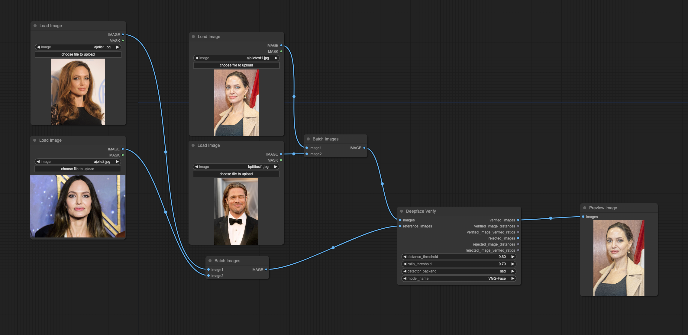

# ComfyUI Deepface

ComfyUI nodes wrapping the [deepface](https://github.com/serengil/deepface) library.

## Requirements

Install dependencies:
```
pip install -r requirements.txt
```

## Nodes

### Deepface Extract Faces

TODO: document

### Deepface Verify

Given a set of input images and a set of reference (face) images, only output the input images with an average distance
to the faces in the reference images less than or equal to the specified threshold. Output images are sorted by average 
distance to the reference image faces (nearest first).

Both inputs accept image batches.

- Outputs:
  - `verified_images` images that contain faces below the threshold, sorted from smallest distance to largest
  - `verified_image_distances` numbers of the average distance from the input image face to each reference image face
  - `verified_image_verified_ratios` the ratio of reference images that deepface marks as "verified" to the total number of reference images. As far as I can tell, deepface sets "verified" to true for distances under 0.3, but this might vary per detector.
  - `rejected_images` images that contain faces above (or equal to) the threshold value for distance, sorted from smallest distance to largest
  - `rejected_image_distances` numbers of the average distance from the input image face to each reference image face
  - `rejected_image_verified_ratios` the ratio of reference images that deepface marks as "verified" to the total number of reference images. As far as I can tell, deepface sets "verified" to true for distances under 0.3, but this might vary per detector.



Nodes from [was-node-suite-comfyui](https://github.com/WASasquatch/was-node-suite-comfyui) and 
[pythongosssss](https://github.com/pythongosssss/ComfyUI-Custom-Scripts) can be used to display the output distances:


# Credits

Inspired by [CeFurkan](https://github.com/FurkanGozukara)'s use of deepface to evaluate finetuning outputs. 🙌 
