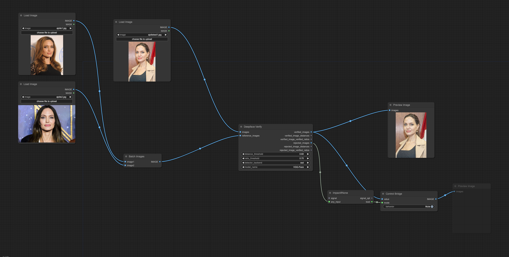

# ComfyUI Deepface

ComfyUI nodes wrapping the [deepface](https://github.com/serengil/deepface) library.

## Requirements

Install dependencies:
```
pip install -r requirements.txt
```

## Nodes

### Deepface Extract Faces

TODO: document

### Deepface Verify

Given a set of input images and a set of reference (face) images, only output the input images with an average distance
to the faces in the reference images less than or equal to the specified threshold. Output images are sorted by average 
distance to the reference image faces (nearest first).

In addition to distance, outputs include the ratio of reference images that each input image was verified to be a 
face match of, according to the default distance threshold of the model selected. This measure complements the average 
distance measure, as there may be one image that is very close (small distance), despite the input image not being a 
great match against all reference images.

Both inputs accept image batches.

- Outputs:
  - `verified_images` images that contain faces below the distance threshold and above the ratio threshold, sorted from smallest distance to largest
  - `verified_image_distances` numbers of the average distance from the input image face to each reference image face
  - `verified_image_verified_ratios` the ratio of reference images that deepface marks as "verified" to the total number of reference images
  - `rejected_images` images that contain faces above (or equal to) the distance threshold or below the ratio threshold, sorted from smallest distance to largest
  - `rejected_image_distances` numbers of the average distance from the input image face to each reference image face
  - `rejected_image_verified_ratios` the ratio of reference images that deepface marks as "verified" to the total number of reference images

Note that any individual output may be `None` if there are no input images matching the criteria.


Nodes from [was-node-suite-comfyui](https://github.com/WASasquatch/was-node-suite-comfyui) and 
[pythongosssss](https://github.com/pythongosssss/ComfyUI-Custom-Scripts) can be used to display the output distances:


ComfyUI's built-in PreviewImage and SaveImage nodes do not handle empty/None inputs, [ComfyUI-Impact-Pack](https://github.com/ltdrdata/ComfyUI-Impact-Pack)
provides nodes that can be used to handle empty/None outputs in conjunction with PreviewImage/SaveImage:



# Credits

Inspired by [CeFurkan](https://github.com/FurkanGozukara)'s use of deepface to evaluate finetuning outputs. 🙌 
